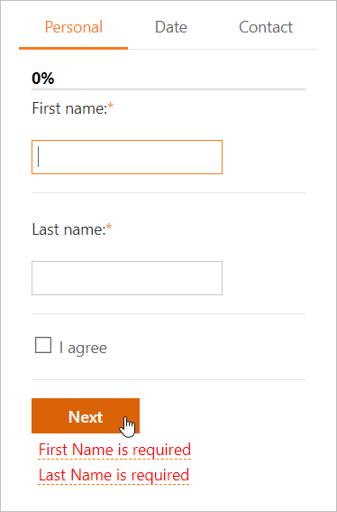

<!-- default badges list -->

<!-- default badges end -->
# Page Control for ASP.NET Web Forms - How to create a wizard
<!-- run online -->
**[[Run Online]](https://codecentral.devexpress.com/e3050/)**
<!-- run online end -->

This example demonstrates how to use the [Page Control](https://docs.devexpress.com/AspNet/DevExpress.Web.ASPxPageControl) to create a wizard interface.

In the wizard, a step is a [tab page](https://docs.devexpress.com/AspNet/DevExpress.Web.TabPage) that displays several editors. Click the **Next** button at the bottom of the current page to proceed to the next step. Click the **Personal**, **Date**, or **Contact** tab to navigate to the corresponding step.

All editors on a page are in the same [validation group](https://docs.devexpress.com/AspNet/DevExpress.Web.ValidationSettings.ValidationGroup). Before you proceed to the next step, the [Validation Summary](https://docs.devexpress.com/AspNet/11626/components/data-editors/validationsummary) control validates values of the editors that belong to the current page's group and displays all errors in one block. Fix the errors to move forward.

## Files to Review

* [Default.aspx](./CS/Default.aspx)
* [Default.aspx.cs](./CS/Default.aspx.cs) 

## Documentation

[How to Validate a Group of Editors](https://docs.devexpress.com/AspNet/11132/components/data-editors/common-concepts/validation/examples/how-to-validate-a-group-of-editors)

## More Examples

- [Page Control for ASP.NET MVC - How to create a Wizard](https://github.com/DevExpress-Examples/how-to-organize-wizard-interface-within-pagecontrol-extension-e3403)
- [Page and Menu Controls for ASP.NET Web Forms - How to create a Wizard](https://github.com/DevExpress-Examples/how-to-organize-wizard-interface-within-aspxpagecontrol-and-aspxmenu-e3052)
- [Page Control for ASP.NET Web Forms - How to validate editor values](https://github.com/DevExpress-Examples/validation-within-a-multi-page-container-e12)
- [Page Control for ASP.NET Web Forms - How to validate editor values on callbacks](https://github.com/DevExpress-Examples/validation-within-a-multipage-container-on-callbacks-e334)
